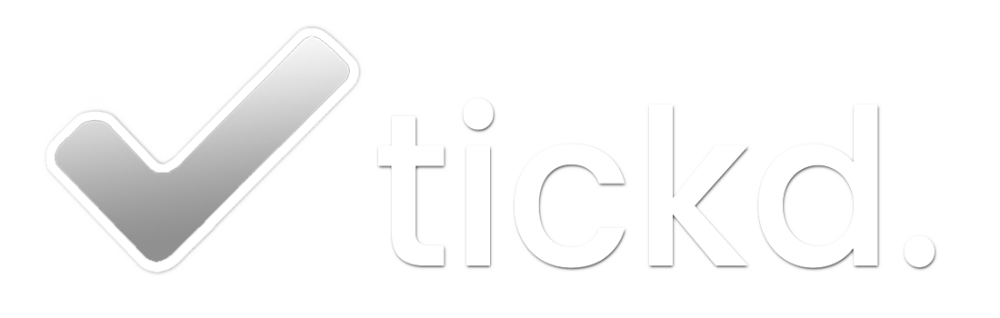

<h1>tickd. task management made easy.</h1>

<h3>To see stuff that could be added, see <a href="ideas.md">here</a>.</h3>

This is the repository for all the stuff to do with my A Level Project, Tickd.

 

<h2>The <b>lib</b> folder</h2>

Contains all the smaller processes, such as <a href="lib//getWallpaper.py">getWallpaper</a> (getting a random wallpaper), <a href="lib//getDetails.py">getDetails</a> [for all json handling], and my own created widgets, such as <a href="lib//checkbox_customTk.py">checkbox</a> and <a href="lib//submitBtn.py">submitBtn</a>.

 

<h2>The structure</h2>

Every 'page' in the app is its own class instance. For example, the authentication screen is first declared in the main program as the object named "auth".  This makes it very easy to quickly get values entered in one screen and then pass them onto a another screen.

 

There are 3 main components to the application

<ol>
  <h3><li>App window</li></h3>
  <ul>
    <li>Essentially the 'master' window of the app, acts as a container for the content frames of the app.</li>
    <li>Also contains a few functions used to refresh data, since this object will contain all of the frames of the app, allowing it to call any methods for any of those frames.</li>
  </ul>
  
  <h3><li>List frames</li></h3>
  <h3><li>Task objects</li></h3>
</ol>
